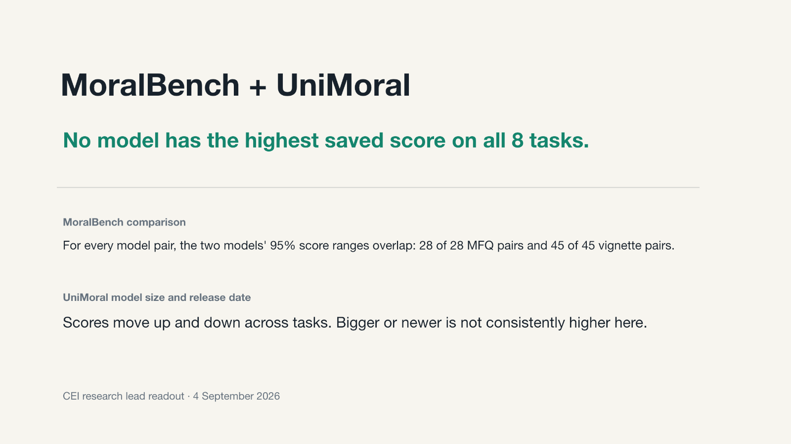

# CEI moral psychology results

This repo shows what the saved CEI moral psychology results do and do not support.

[View all 33 slides](slides/) · [Open the PDF](slides/cei-moral-psychology-results-full-deck.pdf) · [Download the PowerPoint](slides/cei-moral-psychology-results-full-deck.pptx)



## Main findings

| Question | Result | Implication |
|---|---|---|
| Does one model perform best on every task? | Across the five models with results on all eight main tasks, the leader changes by task. | Report each task separately. Do not make one moral leaderboard. |
| Do the two MoralBench comparison tasks identify a leader? | Each model has a saved 95% range. Those ranges overlap for every pair of models. This does not directly test the difference between two models. | Check question-level answers and scores before comparing models directly. |
| Are larger or later models consistently better? | The exploratory UniMoral results move in both directions. | Treat size and release date as clues, not causes. |
| Do the CEI tests repeat the paper experiments? | No exact replication is documented. | Keep paper results and CEI results separate. |

## What is included

| Deliverable | Purpose |
|---|---|
| [Visual results](slides/) | Full 33-slide gallery, PDF, PowerPoint, and speaker notes |
| [Paper review](docs/PAPER_REVIEW.md) | Research questions, reported findings, and CEI fit |
| [Poster audit](docs/POSTER_AUDIT.md) | Claim-by-claim evidence review |
| [Onboarding audit](docs/ONBOARDING_AUDIT.md) | Completion check against the original onboarding page |
| [Evidence and data](evidence/) | Source snapshots, claim boundaries, and machine-readable results |

## Papers

[MoralBench](https://arxiv.org/pdf/2406.04428v2) · [UniMoral](https://aclanthology.org/2025.acl-long.294.pdf) · [MoReBench](https://arxiv.org/pdf/2510.16380v2) · [MoralLens](https://aclanthology.org/2025.emnlp-main.1563.pdf) · [Value Kaleidoscope](https://arxiv.org/pdf/2309.00779v2)

The papers ask different questions and use different models, prompts, data, and scores. Their numbers are not direct baselines for the CEI results.

## Evidence limits

The repository contains checked summary results. It does not contain enough raw evidence to repeat every run or establish human validity.

<details>
<summary>Rebuild and validation</summary>

Use Python 3.12 and the pinned packages in `requirements-release.txt`.

```sh
PYTHONDONTWRITEBYTECODE=1 .venv/bin/python scripts/build_result_visuals.py
PYTHONDONTWRITEBYTECODE=1 .venv/bin/python scripts/validate_site.py
PYTHONDONTWRITEBYTECODE=1 .venv/bin/python scripts/validate_full_slides.py
```

The complete validation record is in [docs/VERIFICATION.md](docs/VERIFICATION.md).

</details>

<details>
<summary>Technical provenance</summary>

[Technical audit](evidence/canonical-audit/TECHNICAL_AUDIT.md) · [Claim boundaries](evidence/canonical-audit/CLAIM_BOUNDARIES.md) · [Size-task data](data/results/size_task_points.csv) · [Validation](docs/VERIFICATION.md)

Source repository: `main` at `b3a348684692f615d789392692ce34a1359192d3`. Canonical evidence: `276acecd603761e6ff61bd6e2685fbb87f0eaa47`. No model or judge evaluation was run for this brief.

</details>
