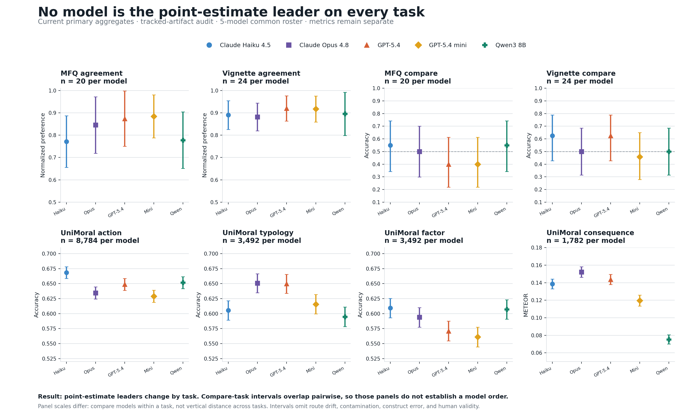
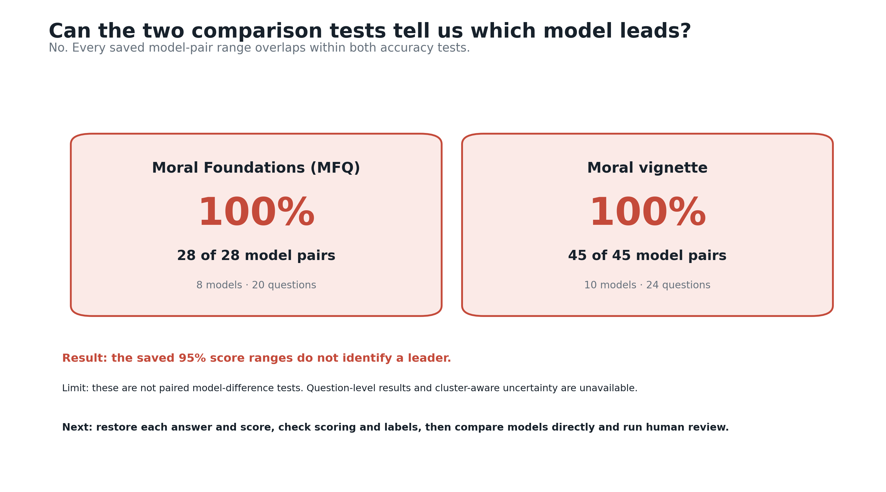
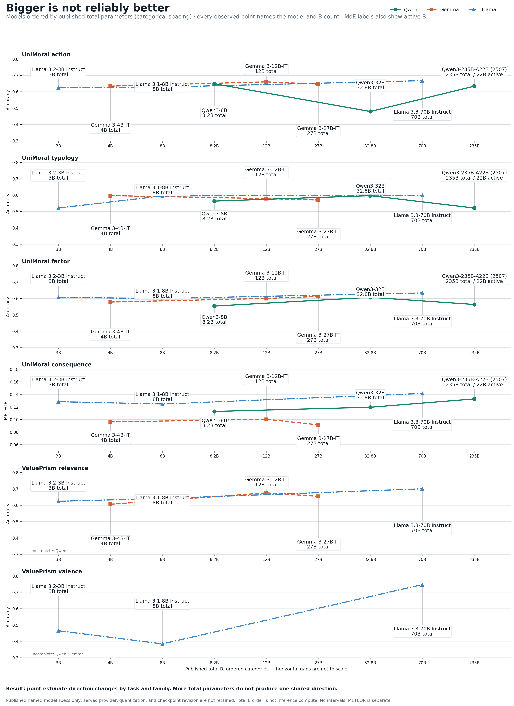
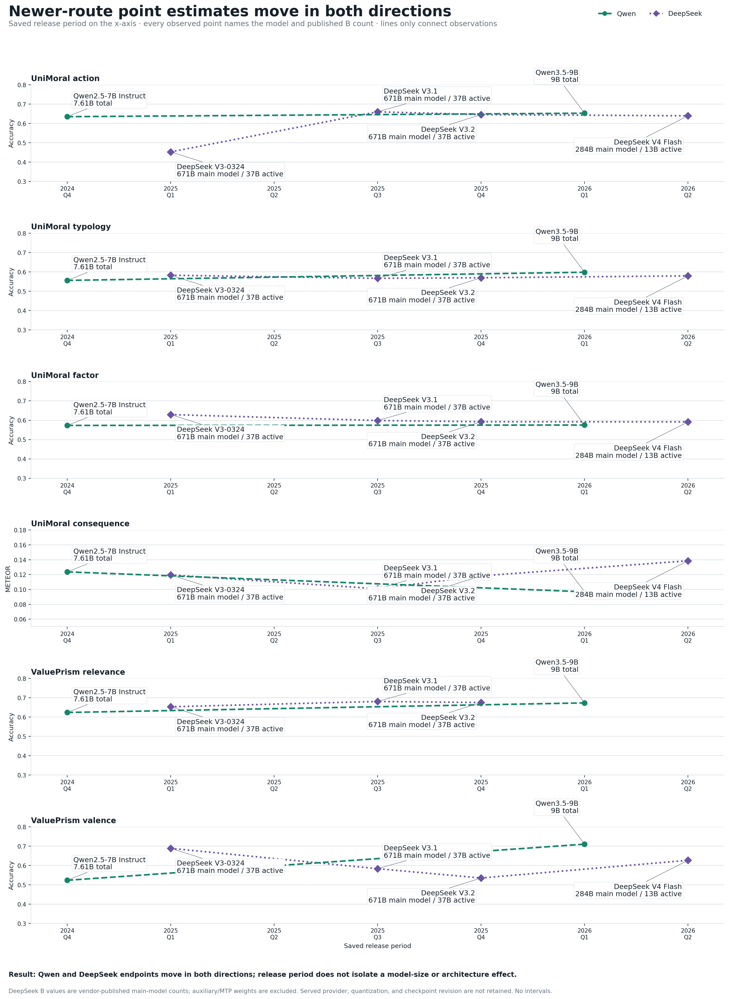

# Results readout

## One-screen answer

| Research question | Answer | Implication |
|---|---|---|
| Is there one stable model order? | No. The point-estimate leader changes across tasks. | Keep the eight task results separate. |
| Where is precision weakest? | The two MoralBench comparison tasks. | Recover paired outcomes first; expand the item banks only if the order remains unresolved. |
| Does bigger reliably perform better? | No. Only 5 of 15 complete paths rise from small to medium to large. | Treat size patterns as family- and task-specific. |
| Do newer-route point estimates all rise? | No. Qwen and DeepSeek both show mixed endpoint directions. | Do not interpret release quarter as a causal trend. |

## 1. Common-roster task results

The main chart uses the only five models that clear every one of the eight primary text-task gates: Claude Haiku 4.5, Claude Opus 4.8, GPT-5.4, GPT-5.4 mini, and Qwen3 8B.

| Task block | Metric | Saved scored rows per model | What the chart supports |
|---|---|---:|---|
| MFQ and vignette agreement | Normalized preference | 20 and 24 | Task-specific agreement levels, with material uncertainty |
| MFQ and vignette comparison | Accuracy | 20 and 24 | Available aggregate intervals do not resolve a model order; every pair overlaps marginally within each comparison task |
| UniMoral action, typology, and factor | Accuracy | 8,784; 3,492; 3,492 | Point estimates differ by task; nominal row-level intervals are narrow |
| UniMoral consequence | METEOR | 1,782 | A generation metric that must not be averaged with accuracy or preference |

The chart does not show a moral score. It shows eight distinct measurements. The narrow UniMoral intervals also do not account for scenario or annotator clustering, route drift, contamination, construct error, or representative human validity.

Source: [`common_roster_primary.csv`](../data/results/common_roster_primary.csv), filtered from the current canonical primary interval table.

## 2. Precision by task

| Task | Median full 95% interval width | Read |
|---|---:|---|
| MFQ compare | `.395` | Too wide to resolve a model order |
| Vignette compare | `.370` | Too wide to resolve a model order |
| MFQ agreement | `.220` | Material uncertainty |
| Vignette agreement | `.124` | Narrower, but still based on a small item bank |
| UniMoral factor | `.033` | Nominal row-level precision |
| UniMoral typology | `.032` | Nominal row-level precision |
| UniMoral action | `.020` | Nominal row-level precision |
| UniMoral consequence | `.012` | Nominal saved-standard-error precision |

All 18 individual intervals wider than `.30` occur in the two comparison tasks. This is a measurement-design finding: recover the paired outcomes first, then expand the item banks only if the order remains unresolved.

Sources: [`task_precision.csv`](../data/results/task_precision.csv) for the task medians; [`primary_confidence_intervals.csv`](../evidence/canonical-audit/figures/data/primary_confidence_intervals.csv) for the 18 individual wide intervals.

## 3. Model size paths

| Family | Complete task paths | Rising | Mixed | Falling | Example counterpattern |
|---|---:|---:|---:|---:|---|
| Gemma | 5 | 1 | 3 | 1 | Typology falls from `.597` to `.579` to `.570`. |
| Llama | 6 | 3 | 3 | 0 | Valence falls at medium size before rising sharply at large size. |
| Qwen | 4 | 1 | 3 | 0 | Action falls from `.649` to `.479`, then recovers to `.634`. |
| **Total** | **15** | **5** | **9** | **1** | A universal “bigger is better” claim is not supported. |

Every marker names the model and its published parameter count. The x-axis orders models by total parameters, but uses equal categorical spacing; distance on the axis is not a numeric size difference. MoE labels show both total and active parameters. Qwen’s 32.8B dense-to-235B/22B MoE step raises total capacity while lowering active parameters per token, so the chart is not an inference-compute comparison. These named-model specifications do not retain the served provider endpoint, quantization, or checkpoint revision.

This selected-grid view is exploratory. It has no saved confidence intervals; Qwen and Llama tiers also change release period, and incomplete task paths are omitted rather than drawn as zero.

Provider metadata records 107,375 reasoning tokens across Qwen3-32B rows despite control attempts. That protocol-budget drift is another reason not to interpret the size lines causally.

Sources: [`size_path_summary.csv`](../data/results/size_path_summary.csv), [`size_task_points.csv`](../data/results/size_task_points.csv), and the official model-card ledger in [`model-parameter-sources.csv`](../evidence/model-parameter-sources.csv).

## 4. Release-period paths

| Family | First to latest available point | Endpoint rises | Endpoint falls or little movement |
|---|---|---|---|
| Qwen | 2024-Q4 to 2026-Q1 | Action, typology, factor, relevance, and valence point estimates rise at the endpoints | Consequence METEOR falls from `.124` to `.097`; factor changes only slightly |
| DeepSeek | 2025-Q1 to 2026-Q2, except relevance ending 2025-Q4 | Action and consequence point estimates rise; relevance rises through its latest available point | Factor, typology, and valence point estimates fall at the endpoints |
| Gemma | No comparable newer scored route | None claimable | The newer route is blocked, so missingness is not a zero score |

Every observed point names its model and published parameter count. DeepSeek MoE labels show the vendor-published main-model and active counts; auxiliary/MTP weights are excluded. These are named-model specifications from revision-pinned official model cards. The saved run metadata does not retain the served provider endpoint, quantization, or checkpoint revision.

Release period is metadata, not an intervention. Route, architecture, and sometimes parameter count move with quarter, so this chart cannot isolate a pure time effect.

DeepSeek V4 rows record 1,171,189 reasoning tokens in total despite control attempts, including the cancelled relevance route and excluded CCD row. Together with the missing raw logs, this makes the latest-route comparison exploratory only.

Sources: [`release_period_task_points.csv`](../data/results/release_period_task_points.csv) and [`model-parameter-sources.csv`](../evidence/model-parameter-sources.csv).

## Evidence ladder

| Level | Use | Do not use it for |
|---|---|---|
| Current primary aggregate; tracked-artifact audit | Current task panels and nominal interval widths | Raw replay, human validity, causal claims, or a cross-metric rank |
| Sensitivity and multimodal extension | Robustness and extension questions | Quietly enlarging the primary set |
| Exploratory selected grid | Generating size and release hypotheses | Confirmatory claims or uncertainty-free ranking |
| Poster-reported legacy evidence | Design history | Numerical publication until replay packets return |
| Canonical UniMoral and ValuePrism crosswalk | Protocol and interpretation context | Claiming exact replication; that 37-row crosswalk has 0 exact matches |

## Visuals deliberately rejected

- A global leaderboard or “moral score,” because it would average accuracy, normalized preference, and METEOR.
- Radar-chart area comparisons, because area would imply commensurable constructs.
- A benchmark “hardest to easiest” order, because metric scales and tasks differ.
- Cross-benchmark correlations built from uneven coverage and incompatible measurements.
- Missing routes plotted as zero, because absence is not model failure.

The canonical limits and claim rules remain binding in [`CLAIM_BOUNDARIES.md`](../evidence/canonical-audit/CLAIM_BOUNDARIES.md) and [`TECHNICAL_AUDIT.md`](../evidence/canonical-audit/TECHNICAL_AUDIT.md).
