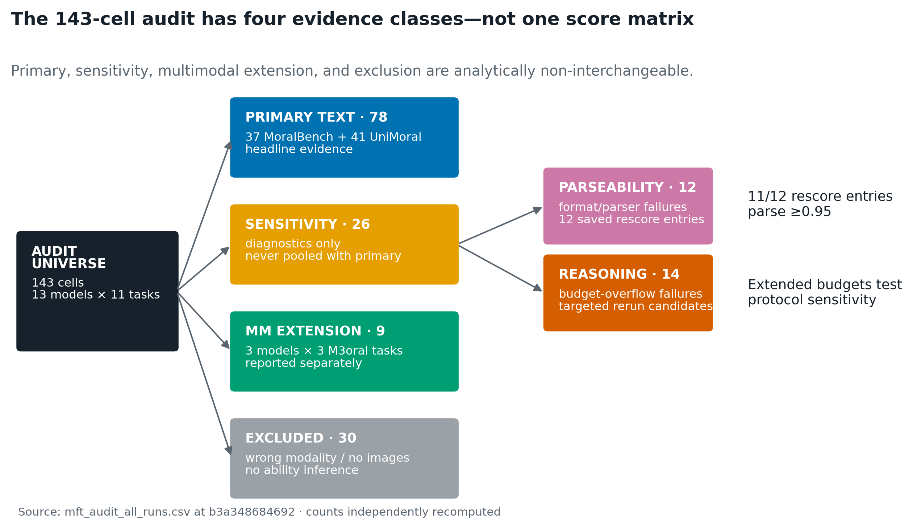
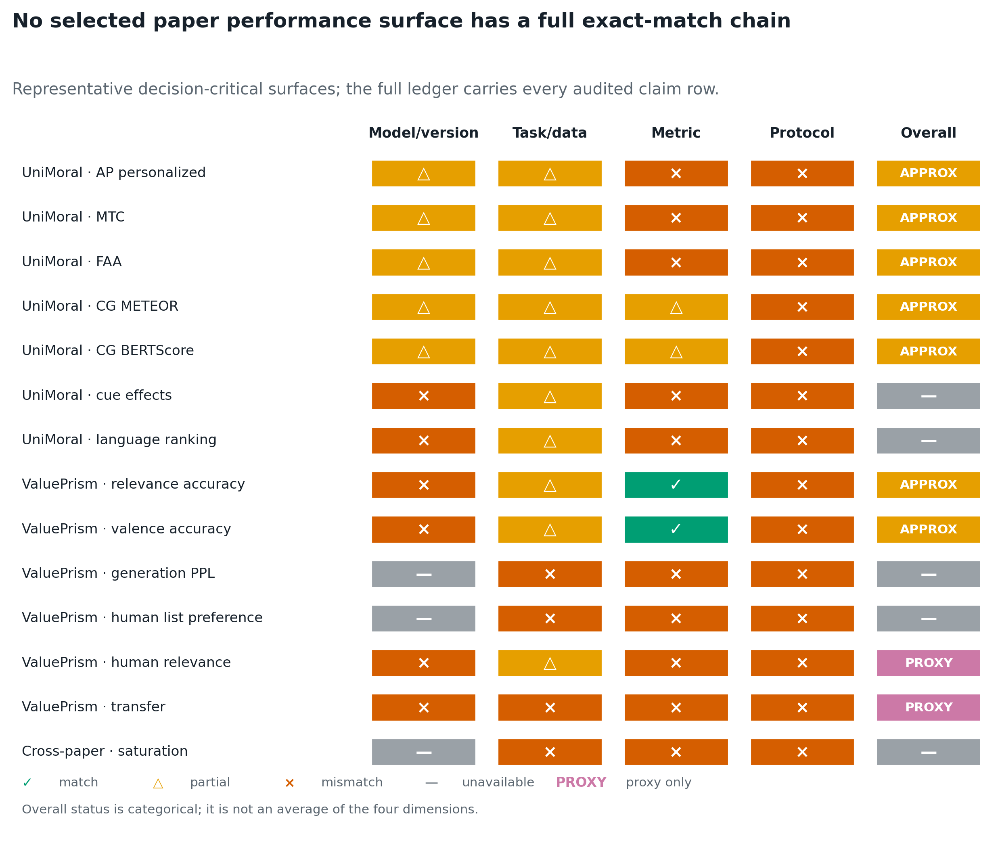
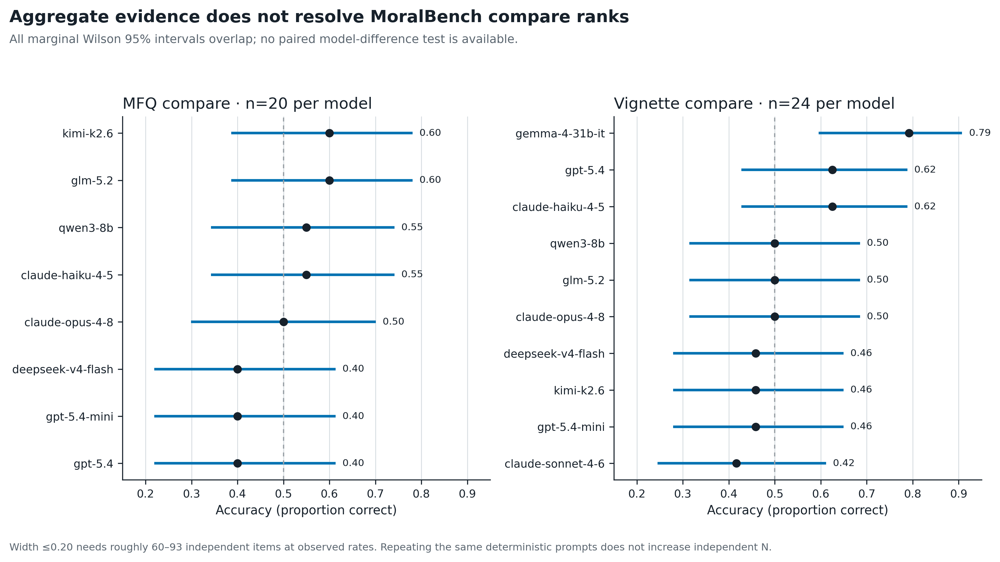
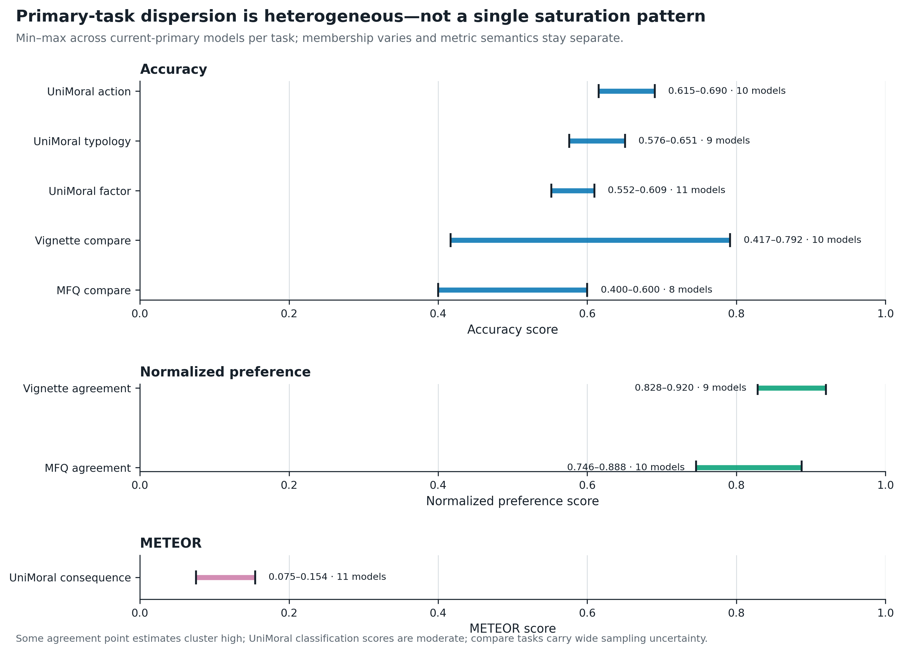
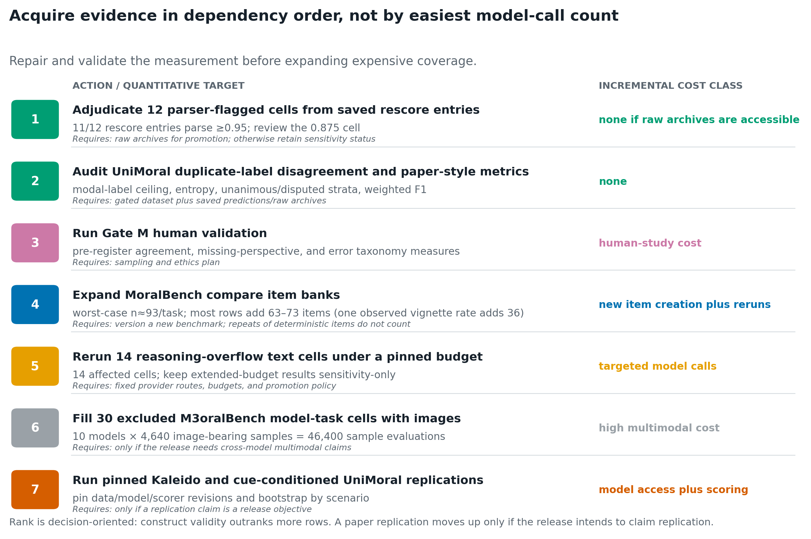

# CEI benchmark-evidence audit — executive readout

**Decision date:** 2026-09-02  
**Repository state:** `main` at `b3a348684692f615d789392692ce34a1359192d3` (merge commit for PR #33)  
**Canonical evidence snapshot:** `276acecd603761e6ff61bd6e2685fbb87f0eaa47d`  
**Operating boundary:** offline audit only; no provider runs, repository writes, Slack, or Notion updates.

## Decision brief

1. **Do not publish a paper-replication claim.** The ledger contains **0 exact performance comparisons**. It classifies 17 rows as approximate, 4 as proxy-only, and 16 as unavailable. The closest bridge is UniMoral's Llama-3.1-8B checkpoint *name*, but the paper used an unpinned local checkpoint, cue-conditioned prompts, weighted F1, and a local Transformers 4.43.3 / PyTorch 2.4.0 / CUDA 12.4 setup; the repository used a 2026 OpenRouter route, no-persona prompts, and mostly accuracy.
2. **The current 143-cell MFT audit partition is internally consistent, but several derived surfaces are stale.** Canonical evidence is **78 primary text + 26 sensitivity-only text + 9 multimodal extension + 30 excluded = 143**. The checked-in confidence file still represents an older 84-primary state, the HTML report mislabels five sensitivity cells as primary, and the reproducibility manifest mislabels one checksum.
3. **Available aggregate uncertainty does not resolve MoralBench compare ranks.** Recomputed current-primary intervals flag 18 cells with full 95% width over 0.30. All 28 MFQ-compare and all 45 vignette-compare within-task marginal interval pairs overlap. The aggregate artifacts provide no paired model-difference test that resolves rank; marginal overlap is a conservative warning, not evidence that ranks reversed.
4. **The evidence does not support broad saturation of simple single-turn moral benchmarks.** The bounded evidence is mixed: MoralBench agreement point estimates cluster high; MoralBench compare surfaces have small item banks, wide marginal intervals, and unresolved ranks; UniMoral classification accuracies are moderate with task-specific spread and unquantified target disagreement; and ValuePrism shows only small descriptive 3B→11B increments on synthetic labels. “Some surfaces show upper-scale clustering or change little” is supportable. “Moral benchmarks are solved” is not.
5. **Highest-value next work is measurement repair and human validation, not indiscriminate reruns.** First adjudicate the 12 parser-flagged cells from the tracked rescore entries and quantify UniMoral duplicate-label disagreement. Then run Gate M human validation. Expand MoralBench compare with independent items only after the construct and target are stable. Reasoning-budget reruns and multimodal completion are conditional coverage work.

## Canonical evidence classes

| Class | Cells | What it supports | What it does not support |
|---|---:|---|---|
| Primary text | 78 | Headline text-task evidence after operational quality gates | Human validity, normative correctness, or exact replication |
| Sensitivity-only text | 26 | Parser and budget diagnostics | Headline model ranking |
| Multimodal extension | 9 | Separate evidence for three image-capable model routes | A complete 13-model multimodal matrix |
| Excluded | 30 | Provenance and failure accounting | Any model-ability inference |

Five models pass all eight primary text gates: Claude Haiku 4.5, Claude Opus 4.8, GPT-5.4, GPT-5.4-mini, and Qwen3-8B. “Gate-passing” is operational: it does not mean the construct is validated, the run-time repository checkout was clean, or the score is precise.

## What is actually comparable to the papers

### UniMoral

The paper's four research questions remain separate: action prediction, moral typology classification, factor attribution, and consequence generation. AP, MTC, and FAA use weighted F1 under moral/cultural/persona/few-shot cues; the repository's fresh bridge uses no-persona prompts and accuracy. Consequence generation has same-family METEOR/BERTScore bridges, but route, decoding, scorer revision, and aggregation are not pinned identically.

The no-persona action task retains three annotator-specific targets per scenario under identical no-persona inputs. Within-scenario disagreement and the modal-label ceiling have not yet been quantified. Before interpreting a tight score range, measure that disagreement and stratify unanimous versus disputed scenarios.

The authoritative paper is the [ACL 2025 Volume 1: Long Papers version](https://aclanthology.org/2025.acl-long.294/), not Findings. It reports no confidence intervals or documented significance tests.

### Value Kaleidoscope / ValuePrism

Relevance and valence are the only task-aligned repository surfaces. They share label spaces and matching rounded row counts make the official test exports plausible, but run artifacts do not retain a dataset path or fingerprint; they also do not use the trained Kaleido models or inference protocol. Relevance uses contrastive synthetic labels: positives were GPT-4-generated for the situation and negatives were sampled from other situations. It is not human importance or normative correctness. Valence accuracy predicts GPT-4's three-way Supports/Opposes/Either label; it is not moral acceptability.

The paper's 60M→11B relevance range is 0.660–0.891 and valence range is 0.597–0.819. The 3B→11B increments are descriptively small (+0.007 and +0.011), but the paper reports no intervals or saturation criterion. The repository's prompted-LLM rows are context, not replications; their raw minima include unadjudicated format/protocol failures. Human list preference, explanation, transfer, entropy, rights coverage, and representation claims are unavailable without their own protocols.

The archival source is the [AAAI 2024 paper](https://ojs.aaai.org/index.php/AAAI/article/view/29970); the detailed tables are in [arXiv v2](https://arxiv.org/abs/2309.00779).

## Does uncertainty change the story?

Yes, in the release interpretation: MoralBench compare should be reported as unresolved rather than rank-ordered. This does not demonstrate a rank reversal. MFQ compare has only 20 items per model and Wilson widths around 0.40. Vignette compare has 24 items and widths roughly 0.31–0.37. At observed rates, full width ≤0.20 generally needs 60–93 independent items; at the worst case near 0.5 it needs 93. Repeating the same deterministic items does not add independent item-level N.

Large UniMoral and ValuePrism row counts yield narrow nominal row-level errors under the saved estimators, but clustered or resampling uncertainty was not estimated. Those errors do not absorb scenario/annotator dependence, prompt selection, provider-route drift, benchmark contamination, or construct uncertainty. Precision is not validity.

## Best account of “saturation”

A defensible three-part statement is:

- **Upper-scale clustering / small increments:** some MoralBench agreement point estimates occupy a high band, although their intervals remain material; Kaleido 3B and 11B differ little descriptively on two synthetic classification tasks, without paper CIs.
- **Diagnostic spread:** UniMoral classification accuracies retain task-specific spread at moderate levels. Consequence-generation METEOR also varies, but its distance from 1 is not a validated ceiling gap and stays separate from classification metrics.
- **Insufficient precision / rank resolution:** small MoralBench comparison sets have wide marginal intervals, and the aggregate artifacts do not provide a paired model-difference analysis.

These can coexist. None establishes genuine moral understanding. The benchmark frameworks are **measurement coordinate systems**—ways to describe preferences, categories, factors, values, rights, or duties. They are not definitions of the correct values for AI systems, and their scores must not be collapsed into a moral ranking.

## Recommended sequence

1. Repair stale release surfaces and adjudicate existing parser rescores—no new provider calls.
2. Quantify UniMoral target disagreement and recompute paper-style weighted F1/strata from saved predictions when archives and the gated dataset are accessible.
3. Run Gate M human validation; this has the highest construct-validity information value.
4. Version a larger, independently sampled MoralBench compare bank (about 93 items/task for worst-case Wilson width ≤0.20), preserving the current benchmark as a frozen anchor.
5. Rerun the 14 reasoning-overflow text cells under a pinned sensitivity protocol.
6. Complete the 30 excluded multimodal cells only if cross-model multimodal coverage is release-critical.
7. Run pinned paper replications only if the release intends to claim replication.

## Release call

**Safe now:** publish an audit-qualified inventory that keeps primary, sensitivity, extension, and excluded evidence separate; report task-level metrics with uncertainty; state that paper links are approximate or unavailable.  
**Not safe now:** claim exact paper replication, broad saturation, genuine moral understanding, cross-metric leaderboard superiority, or normative alignment.

## Deliverable map

- [Evidence ledger](PAPER_REPO_EVIDENCE_LEDGER.csv)
- [Technical audit](TECHNICAL_AUDIT.md)
- [Claim boundaries](CLAIM_BOUNDARIES.md)
- [Rerun priority](RERUN_PRIORITY.md)
- [Filterable explorer](index.html)
- [Adversarial self-critique](SELF_CRITIQUE.md)
- [Figure source data](figures/data/)
