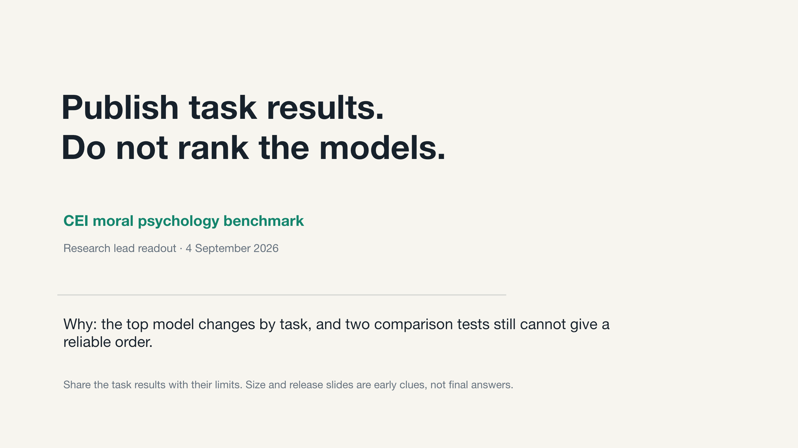
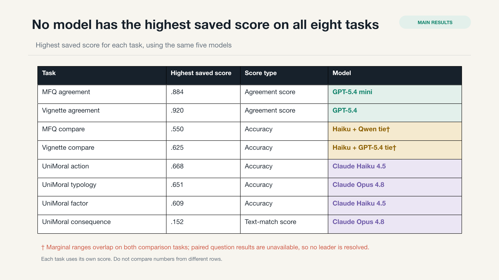
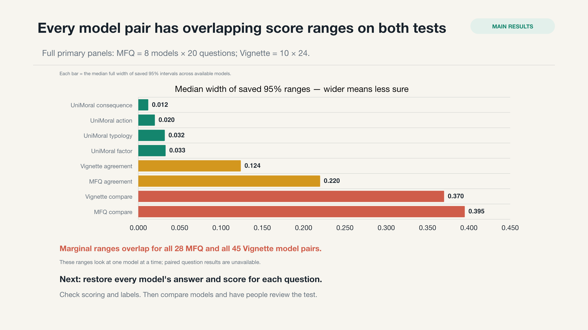
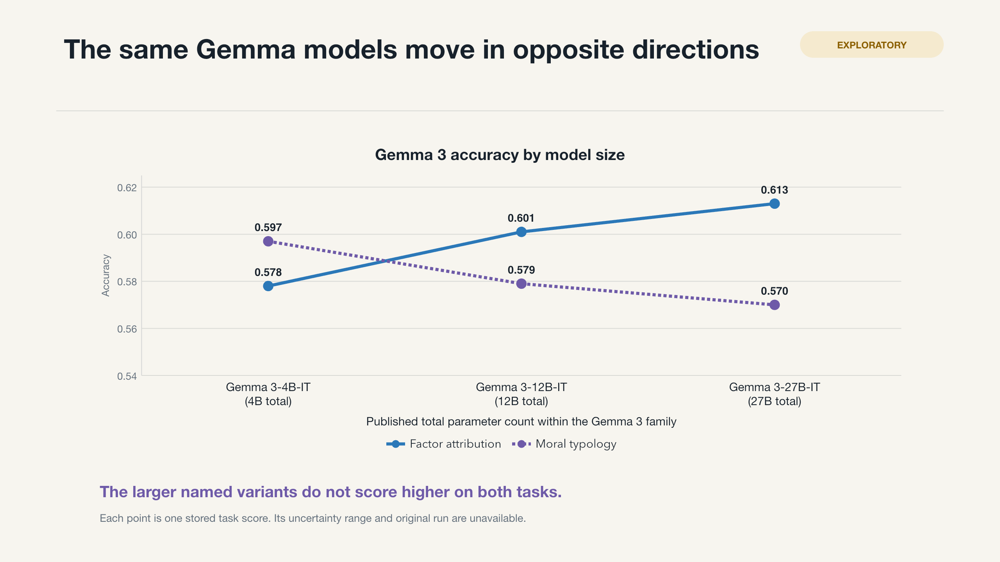
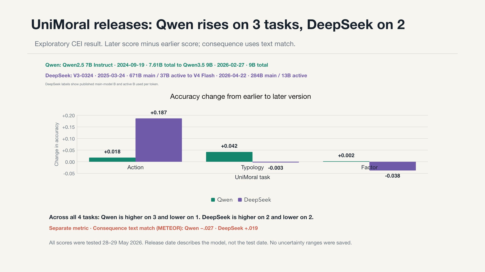
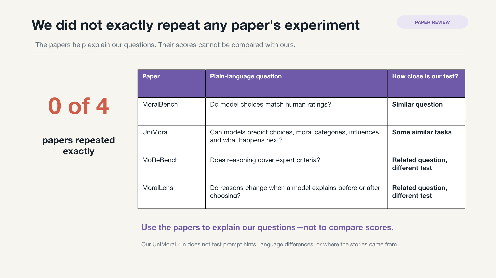
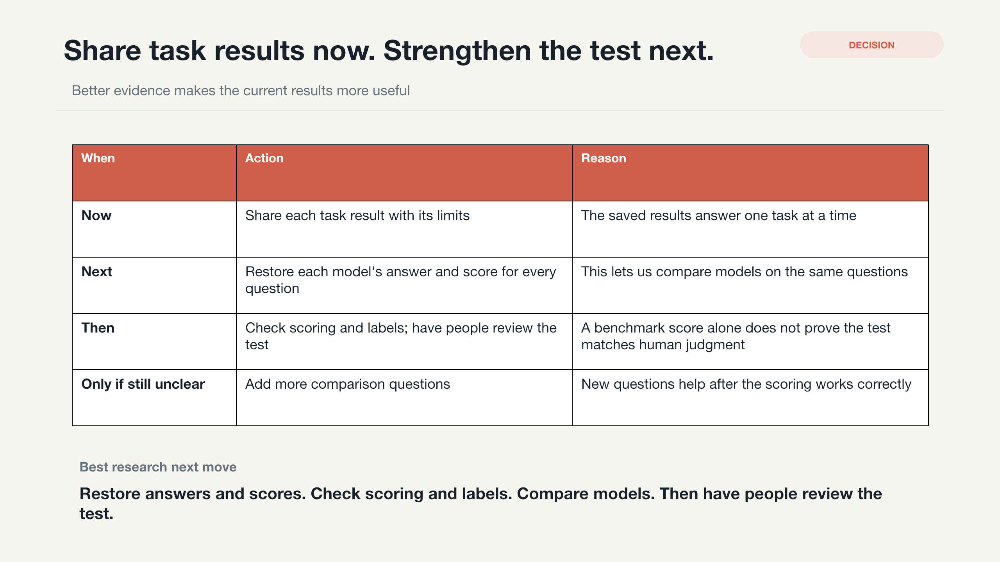

# Visual results

[Read the one-minute result](../docs/ONE_MINUTE_READOUT.md) · [Open the view-only PDF](cei-moral-psychology-results-deck.pdf) · [Download the editable PowerPoint](cei-moral-psychology-results-deck.pptx)

Click any slide to open the 2560 × 1440 image.

## 1. Publish task results. Do not rank the models.

## 2. No model has the highest saved score on all eight tasks

## 3. Every model pair has overlapping score ranges on both tests

## 4. Only 4 of 12 model-and-task cases rise twice · Exploratory

## 5. Gemma scores rise on one task and fall on another · Exploratory

## 6. Later versions score higher on some tasks and lower on others · Exploratory

## 7. We did not exactly repeat any paper's experiment · Paper review

## 8. Share task results now. Strengthen the test next. · Decision

